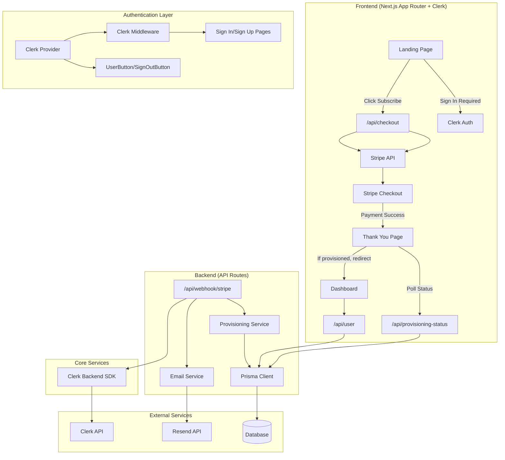

# Stripe Subscription Prototype Architecture

## Overview
A Next.js 16 application with Clerk authentication, Prisma v7, and Stripe integration for subscription-based access control.

## Architecture Flow



## Directory Structure

```
stripe-prototype/
src/
  app/                          # Next.js App Router
    api/                         # API Routes
      checkout/
        route.ts                # Stripe Checkout session creation
      webhook/
        stripe/
          route.ts              # Stripe webhook handler + email trigger
      provisioning-status/
        route.ts                # Provisioning status polling
      user/
        route.ts                # User data endpoint
    dashboard/
      page.tsx                  # Pro user dashboard
    thank-you/
      page.tsx                  # Post-payment polling page
    sign-in/
      [[...sign-in]]/
        page.tsx                # Clerk sign-in page
    sign-up/
      [[...sign-up]]/
        page.tsx                # Clerk sign-up page
    page.tsx                    # Landing page with Subscribe button
    layout.tsx                  # Root layout with ClerkProvider
    globals.css                 # Global styles
  middleware.ts                 # Clerk middleware for route protection
  lib/                          # Shared utilities
    prisma.ts                   # Prisma client singleton
    stripe.ts                   # Stripe client (lazy init)
    env.ts                      # Environment variables & validation
    constants.ts                # Shared constants
  services/                     # Business logic
    provision-user.ts           # Idempotent user provisioning
    send-confirmation-email.ts  # Resend email service
prisma/
  schema.prisma                 # Database schema
  dev.db                       # SQLite database file
.env.local                     # Environment variables (secrets)
.env.local.example             # Environment template
```

## Component Responsibilities

### Frontend Components

| Component | Responsibility | Dependencies |
|-----------|----------------|--------------|
| **Landing Page** | Auth-aware subscription offer, conditional UI, logout | Clerk `useUser`, `/api/checkout` |
| **Thank You Page** | Poll provisioning status, redirect when ready | `/api/provisioning-status` |
| **Dashboard** | Show user status and Pro features, logout | `/api/user`, Clerk `UserButton`/`SignOutButton` |
| **Layout** | Global styling, Clerk provider context | ClerkProvider, Tailwind/CSS |
| **Sign In Page** | Clerk authentication flow | Clerk `<SignIn />` |
| **Sign Up Page** | Clerk registration flow | Clerk `<SignUp />` |
| **Middleware** | Route protection, auth enforcement | Clerk `clerkMiddleware` |

### API Routes

| Route | Method | Responsibility | Dependencies |
|-------|--------|----------------|--------------|
| `/api/checkout` | POST | Create Stripe Checkout session | Stripe API |
| `/api/webhook/stripe` | POST | Handle Stripe webhook events | Provisioning Service |
| `/api/provisioning-status` | GET | Check user provisioning status | Prisma DB |
| `/api/user` | GET | Get current user data | Prisma DB |

## Current Implementation State

### Phase: Complete Production-Ready Flow

**What's Working:**
- Clerk authentication (sign-in/sign-up/logout)
- Route protection for `/dashboard` and `/thank-you`
- Auth-aware UI on landing page and dashboard
- Real user checkout with Clerk identity
- Webhook provisioning by `clerkId` with dual write (Prisma + Clerk metadata)
- Confirmation email via Resend after successful provisioning
- All API routes gated by `auth()`

**Identity Flow (Complete):**
```
Real User Sign In -> Subscribe to subscription -> Stripe webhook -> Provision by clerkId -> Email confirmation -> Dashboard shows real user data
```

**Architecture Highlights:**
- **Dual Write Pattern**: Webhook updates both Prisma (source of truth) and Clerk metadata (fast client reads)
- **Non-Blocking Email**: Email failures don't break provisioning
- **Separation of Concerns**: Dedicated services for provisioning and email
- **Best Practices**: Clerk `clerkId` as primary key, error handling, idempotency

**Production Considerations:**
- Replace `onboarding@resend.dev` with verified domain in Resend
- Configure production Clerk keys
- Set up production Stripe webhook endpoint
- Consider email templates and branding

### Core Services

| Service | Responsibility | Key Features |
|---------|----------------|--------------|
| **Provisioning Service** | Idempotent user provisioning | Atomic upsert, plan management |
| **Email Service** | Confirmation email delivery | Resend integration, non-blocking |
| **Prisma Client** | Database connection management | Singleton pattern, SQLite adapter |
| **Stripe Client** | Payment processing | Lazy initialization, error handling |

## Data Flow

### 1. Subscription Initiation
```
User clicks Subscribe
  POST /api/checkout
    Create Stripe session
    Return session URL
  Redirect to Stripe Checkout
```

### 2. Payment Completion
```
Stripe processes payment
  Webhook to /api/webhook/stripe
    Verify signature
    Check idempotency (WebhookEvent table)
    Call Provisioning Service
      Update user to 'pro' plan
      Set isProvisioned = true
```

### 3. Post-Payment Flow
```
User redirected to Thank You page
  Poll /api/provisioning-status every 2s
    Check user.isProvisioned
    Return status
  When provisioned:
    Redirect to Dashboard
```

### 4. Dashboard Access
```
Dashboard loads
  GET /api/user
    Return user data
  Display based on plan:
    - 'free': Show upgrade prompt
    - 'pro': Show all features
```

## Separation of Concerns

### Frontend (UI Layer)
- **Responsibility**: User interaction, display logic, navigation
- **No**: Business logic, database access, payment processing
- **Communication**: API calls only

### API Routes (Controller Layer)
- **Responsibility**: HTTP request handling, input validation, response formatting
- **No**: Complex business logic, direct database queries (use services)
- **Communication**: Services, external APIs (Stripe)

### Services (Business Logic Layer)
- **Responsibility**: Core business rules, data transformation, idempotency
- **No**: HTTP concerns, UI logic
- **Communication**: Database only

### Database (Data Layer)
- **Responsibility**: Data persistence, relationships, constraints
- **No**: Business logic, API concerns
- **Access**: Through Prisma client only

## Key Architectural Decisions

### 1. Lazy Stripe Initialization
- **Why**: Prevents build-time crashes with placeholder keys
- **How**: `getStripe()` function creates client on first use
- **Benefit**: Works in dev/test environments without real keys

### 2. Idempotent Provisioning
- **Why**: Handle duplicate webhook deliveries safely
- **How**: `WebhookEvent` table tracks processed event IDs
- **Benefit**: Guarantees exactly-once processing

### 3. Polling-Based Status Check
- **Why**: Webhook processing is asynchronous
- **How**: Thank You page polls `/api/provisioning-status` every 2s
- **Benefit**: Smooth user experience without long-loading pages

### 4. Read-Only User API
- **Why**: UI should not trigger side effects
- **How**: `/api/user` only returns existing data or safe defaults
- **Benefit**: Prevents accidental user creation from UI

### 5. Environment Variable Decoupling
- **Why**: Centralized configuration and validation
- **How**: Environment variables centralized in `env.ts` with validation
- **Benefit**: Routes don't depend on Stripe module, clear configuration

## Security Considerations

### Webhook Security
- Stripe signature verification
- Event idempotency checking
- Error handling without exposing details

### Data Access
- Prisma adapter pattern prevents SQL injection
- Environment variables for secrets
- Read-only endpoints where appropriate

### Error Handling
- Generic error messages to users
- Detailed logging for debugging
- Graceful degradation for missing data

## Scalability Notes

### Current Limitations
- SQLite for prototype (switch to PostgreSQL for production)
- In-memory Prisma client (connection pooling needed for scale)

### Production Readiness
- Replace SQLite with PostgreSQL
- Implement connection pooling
- Add monitoring and logging
- Configure proper error reporting
- Verify custom domain in Resend for email sending
